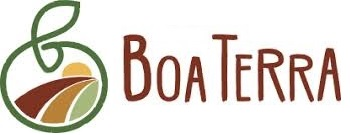

# BoaTerra
<p align="center"><a href="" target="_blank" ></a></p>

## Title
Boa Terra
## Description
Este proyecto es un sistema de gestión de un local comercial que brinda diferentes productos al público, 
como el caso de FRUTAS - VERDURAS - ESPECIAS - SEMILLAS - BOCADILLAS - PRODUCTOS LIBRES DE GLUTEN.

En el cual brindará difetenes funciones, como por ejemplo: 
Crear, leer, actualizar  y eliminar registros de clientes, usuarios, personal del local. Tambien permitiendo tener un registro de las ventas efectuadas.
La pila de tecnologia utilizada es MERN.

MERN es una pila completa, que sigue el patrón arquitectónico tradicional de 3 niveles, incluido el nivel de visualización de front-end (React.js), el nivel de aplicación (Express.js y Node.js) y el nivel de base de datos (MongoDB).
Los servidores gratuitos utilizados para correr el proyecto son MongoDB Atlas, Netlify y Heroku.

## Requerimientos
Necesita instalar Visual Studio Code, luego clonar el repositorio de GitHub.

## Comandos para correr el proyecto son:

```javascript
git clone URL
npm install

```
Ubicado en la raiz del proyecto debes correr el siguiente comando:

En el proyecto de Front-end
## `npm start`

En el proyecto de Back-end
## `npm run dev`

Ejecuta la aplicación en modo de desarrollo. Abra http://localhost:8080/ para verlo en el navegador.

La página se volverá a cargar si realiza modificaciones. También verá cualquier error de pelusa en la consola.

## URL publico para clonar el proyecto de github:

Frontend-URL:https://github.com/bertini91/BoaTerra.git

Backend-URL:https://github.com/bertini91/TheRollingNew-Backend

## Autor
Nicolás Bertini Argañaras - Estudiante de Ingenieria en Sistemas de Información en UTN-Frt

## Link del Sitio Web
https://boaterratuc.netlify.app/
